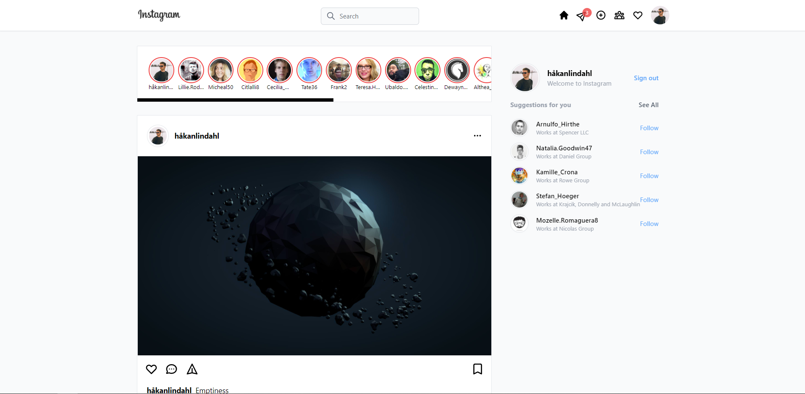

<div id="top"></div>
<!-- PROJECT SHIELDS -->
<!--
*** I'm using markdown "reference style" links for readability.
*** Reference links are enclosed in brackets [ ] instead of parentheses ( ).
*** See the bottom of this document for the declaration of the reference variables
*** for contributors-url, forks-url, etc. This is an optional, concise syntax you may use.
*** https://www.markdownguide.org/basic-syntax/#reference-style-links
-->


<!-- PROJECT LOGO -->

<!-- ABOUT THE PROJECT -->
## About The Project

<div align="center">
  
</div>
<br/>

A visual clone of Instagram web app to improve my skills in frontend development. In the projects some new libraries are explored. These include Firebase for database management, Next Auth with Google authorization, Recoil for React state management, HeadlessUI for visual components and React Moment for showing relevant timestamps.

<p align="right">(<a href="#top">back to top</a>)</p>


### Built With

* [Next.js](https://nextjs.org/)
* [Tailwind](https://tailwindcss.com/)
* [Next Auth](https://next-auth.js.org/)
* [Firebase](https://firebase.google.com/)
* [Typescript](https://www.typescriptlang.org/)
* [Recoil](https://recoiljs.org/)
* [React Moment](https://www.npmjs.com/package/react-moment)
* [HeadlessUI](https://headlessui.dev/)

<p align="right">(<a href="#top">back to top</a>)</p>


<!-- GETTING STARTED -->
## Getting Started

This is an instruction to setting up your project locally.

### Prerequisites

### Installation

Below is an example of how you can install and set up your app.

1. Clone the repo
   ```sh
   git clone https://github.com/HawkieOne/instagram-clone
   ```
2. Install NPM packages
   ```sh
   npm install
   ```
3. Create a new file called `.env.local`
4. Go to https://console.firebase.google.com and get a `CLIENT` and `CLIENT_SECRET` key for your app
5. Place your keys in the `.env.local` file like below
   ```sh
   GOOGLE_CLIENT_ID=YOUR_CLIENT_ID
   GOOGLE_CLIENT_SECRET=YOUR_CLIENT_SECRET
   NEXTAUTH_URL=http://localhost:3000
   ```
2. Run your application
   ```sh
   npm run dev
   ```

<p align="right">(<a href="#top">back to top</a>)</p>

<!-- LICENSE -->
<!-- ## License

Distributed under the MIT License. See `LICENSE.txt` for more information.

<p align="right">(<a href="#top">back to top</a>)</p> -->


<!-- CONTACT -->
## Contact

Håkan Lindahl - [/hakanlindahl](https://www.linkedin.com/in/h%C3%A5kan-lindahl-3a0427153/) - hakan.l.lindahl@gmail.com
<br />
Project Link: [https://github.com/HawkieOne/instagram-clone](https://github.com/HawkieOne/instagram-clone)

<p align="right">(<a href="#top">back to top</a>)</p>


<!-- MARKDOWN LINKS & IMAGES -->
<!-- https://www.markdownguide.org/basic-syntax/#reference-style-links -->
[contributors-shield]: https://img.shields.io/github/contributors/othneildrew/Best-README-Template.svg?style=for-the-badge
[contributors-url]: https://github.com/othneildrew/Best-README-Template/graphs/contributors
[forks-shield]: https://img.shields.io/github/forks/othneildrew/Best-README-Template.svg?style=for-the-badge
[forks-url]: https://github.com/othneildrew/Best-README-Template/network/members
[stars-shield]: https://img.shields.io/github/stars/othneildrew/Best-README-Template.svg?style=for-the-badge
[stars-url]: https://github.com/othneildrew/Best-README-Template/stargazers
[issues-shield]: https://img.shields.io/github/issues/othneildrew/Best-README-Template.svg?style=for-the-badge
[issues-url]: https://github.com/othneildrew/Best-README-Template/issues
[license-shield]: https://img.shields.io/github/license/othneildrew/Best-README-Template.svg?style=for-the-badge
[license-url]: https://github.com/othneildrew/Best-README-Template/blob/master/LICENSE.txt
[linkedin-shield]: https://img.shields.io/badge/-LinkedIn-black.svg?style=for-the-badge&logo=linkedin&colorB=555
[linkedin-url]: https://linkedin.com/in/othneildrew
[product-screenshot]: images/screenshot.png
